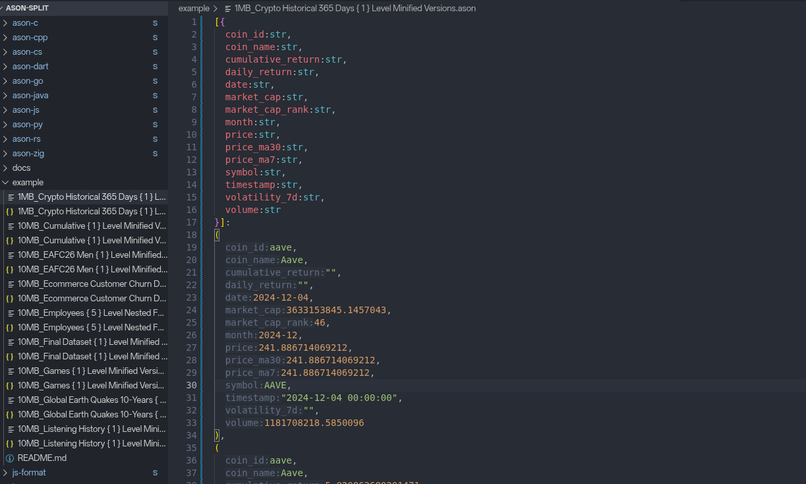

# ASUN Support for VS Code



`ASUN Support` brings first-class editing support for ASUN files to Visual Studio Code.

ASUN is designed for structured data that should stay compact, readable, and strongly shaped at the same time. Instead of treating data as loose JSON blobs, ASUN keeps schema and values close together, which makes large config files, fixtures, datasets, and generated data easier to scan and safer to edit.

## Why ASUN

ASUN is useful when you want more structure than plain JSON, without giving up readability.

- Schema and data stay together, so the shape of the content is visible where you read it.
- Tuple-style records reduce repetition in repeated datasets.
- Stronger typing makes mistakes easier to catch early.
- The format stays compact for storage, but can still be expanded into a readable layout.

Example:

```asun
[{name@str, age@int, active@bool}]:
  (Alice, 30, true),
  (Bob, 24, false)
```

Compared with repeated object keys in JSON, this format is often shorter and easier to inspect in bulk data.

## Format Advantages

ASUN has practical serialization advantages because of how the format is designed, not just because of editor tooling.

- The schema is written once, instead of repeating keys in every object.
- Repeated records are stored as tuples, which reduces structural noise.
- Optional type annotations make data contracts visible and easier to validate.
- The same schema can be used for both human-readable text and more compact binary-oriented workflows in the broader ASUN ecosystem.

For array-shaped or repeated structured data, that usually means less text to move, parse, and send to models.

## Efficiency and Performance

Based on benchmarks and examples in the ASUN implementations in this repository, the main gains versus JSON are:

- Token usage: typically **30% to 70% fewer tokens**
- Payload size: typically **40% to 60% smaller**
- Text serialization: commonly **about 1.4x to 2.4x faster**
- Text deserialization: commonly **about 1.9x to 4.4x faster**

The main reason is simple: JSON repeats field names for every row, while ASUN writes the schema once and then only emits values.

Concrete example used across the project:

```text
JSON: 100 tokens
ASUN: ~35 tokens
Saving: ~65%
```

For many structured datasets, that also means noticeably less network bandwidth and lower LLM prompt cost.

## Features

This extension focuses on daily editing workflows, not just file recognition.

- Syntax highlighting for `.asun` files
- Markdown fenced code block highlighting for `asun`
- Real-time diagnostics from the ASUN language server
- Document formatting for readable multiline layout
- Compression/minification for compact output
- Convert ASUN to JSON
- Convert JSON to ASUN
- Inlay hints for tuple field names
- Semantic tokens for richer editor coloring
- Context menu and command palette integration

## What You Can Do

### Format for readability

Turn dense ASUN into a clean, aligned structure.

Before:

```asun
{name@str,age@int,addr@{city@str,zip@int}}:(Alice,30,(NYC,10001))
```

After:

```asun
{name@str, age@int, addr@{city@str, zip@int}}:
  (Alice, 30, (NYC, 10001))
```

### Compress for transport or storage

Convert formatted content back into a compact single-line representation.

```asun
{name@str,age@int}:(Alice,30)
```

### Convert between ASUN and JSON

Use ASUN where schema-aware editing is helpful, then export JSON when another system expects it.

ASUN:

```asun
{name@str, age@int, active@bool}:
  (Alice, 30, true)
```

JSON:

```json
{
  "active": true,
  "age": 30,
  "name": "Alice"
}
```

### Read tuple data faster with inlay hints

For tuple-style records, the extension can display field-name hints inline so values are easier to interpret while editing.

Source:

```asun
{name@str, age@int, city@str}:(Alice, 30, NYC)
```

Displayed in the editor:

```text
{name@str, age@int, city@str}:(name: Alice, age: 30, city: NYC)
```

## Commands

The extension adds these commands:

- `ASUN: Format (Beautify)`
- `ASUN: Compress (Minify)`
- `ASUN: Convert to JSON`
- `ASUN: Convert JSON to ASUN`

They are available from the Command Palette, and the relevant actions also appear in the editor context menu.

## Configuration

Available settings:

- `asun.lspPath`: absolute path to the `lsp-asun` binary if you want to override auto-detection
- `asun.inlayHints.enabled`: enable or disable tuple field-name hints

If the bundled or default server path is not detected automatically, set:

```json
{
  "asun.lspPath": "/absolute/path/to/lsp-asun"
}
```

## Getting Started

1. Install the extension.
2. Open or create a `.asun` file.
3. Run `ASUN: Format (Beautify)` or `ASUN: Convert to JSON` from the Command Palette.

If syntax highlighting works but diagnostics or formatting do not, the ASUN language server is usually missing or not found. In that case, set `asun.lspPath` manually.

## Build and Packaging

Marketplace-facing documentation is intentionally kept separate from build instructions.

- [Developer build guide](./build.md)
- [Chinese build guide](./build_cn.md)

## Repository

[Source code](https://github.com/asunLab/asun)
